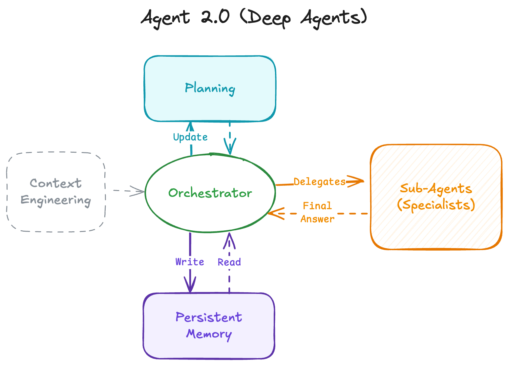
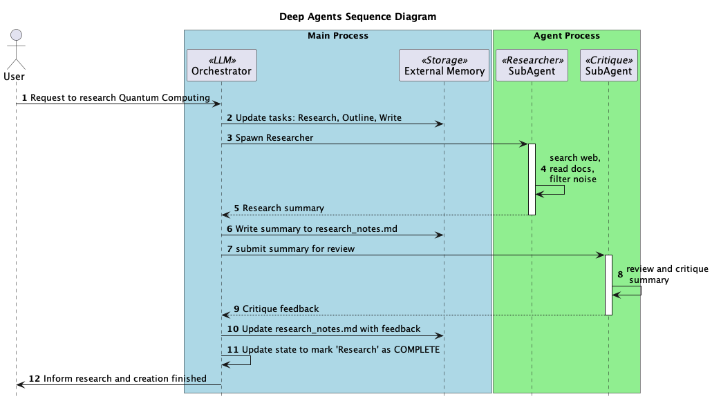

# 🧠🤖 LangGraph4j Deep Agents (Agentic 2.0)

> A reference implementation of **Deep Agents** (aka *Agents 2.0*) in Java using [LangGraph4j].  
> Move beyond one-loop “shallow” agents to explicit planning, hierarchical delegation, persistent memory, and rigorous context engineering.



---

## Why Deep Agents?

Classic agents often run a simple loop: **think → call a tool → observe → repeat**. That’s great for quick, transactional queries, but it breaks down on multi-hour or multi-day tasks (hallucinations, loss of goal, looping, no recovery).  
**Deep Agents** try fix this by **changing the architecture**, not just the prompt:

1. **Explicit Planning** – The agent continuously maintains a plan (e.g., a TODO in Markdown) with clear statuses instead of hiding intent in a just chain-of-thought.
2. **Hierarchical Delegation (Sub-Agents)** – An **Orchestrator** delegates to specialized agents (Researcher, Coder, Writer, …), each working in a clean context and returning synthesized results.
3. **Persistent Memory** – Intermediate artifacts (notes, code, data) are written to external storage (filesystem, vector store, …) and referenced by path/query rather than stuffing everything into the context window.
4. **Extreme Context Engineering** – Long, specific instructions define: when to plan vs. act, when to spawn sub-agents and the human-in-the-loop(HITL) rules.

This repository demonstrates those four pillars.

> The design is inspired by the Deep Agents pattern popularized by [LangChain](https://blog.langchain.com/deep-agents/) and based on the [python version](https://github.com/hwchase17/deepagents) adapted to [LangGraph4j] using [Spring AI].
>
> ‼️ Currently HITL is not implemented yet.

---

## Getting started

### Clone project
```bash
git clone https://github.com/langgraph4j/langgraph4j-deepagents.git
cd langgraph4j-deepagents
````

### Example

This repo includes sample code under `src/test` that create a **Deep Researcher Agent** that use [Tavily] as web search engine and [OpenAI gpt-4o-mini model] 

#### Configuration

* **Memory**: Virtual Filesystem by default. You can swap in your DB of choice.
* **Prompts**: Tune the system prompts in the [`Prompts.java`](src/main/java/org/bsc/langgraph4j/deepagents/Prompts.java) to match your domain.
* **Models**: Bring your own LLM via [Spring AI] bindings (OpenAI, Anthropic, local models, etc.).
  
  > set your model/provider keys in environment variables or a `.env` consumed by your Spring AI integration.
  > ```
  > OPENAI_API_KEY=xxxxxxxxxxxxxxxxxxxxxxxxxxxxxxxxxxxxxxxxxx 
  > TAVILY_API_KEY=xxxxxxxxxxxxxxxxxxxxxxxxxxxxxxxxxxxxxxxxxx
  > ```

#### Creating a Deep Agent with LangGraph4j

Let's look at a sequence diagram for a Deep Agent handling a complex request: 



Below a representative code snippet that implements the Deep Agents in the diagram 

```java
// Create a Researche Sub Agent

var researchSubagent = DeepAgent.SubAgent.builder()
    .name("research-agent")
    .description("""
        Used to research more in depth questions. Only give this researcher one topic at a time.
        Do not pass multiple sub questions to this researcher.
        Instead, you should break down a large topic into the necessary components, and then call multiple research agents in parallel, one for each sub question.
        """)
    .prompt("""
        You are a dedicated researcher. Your job is to conduct research based on the users questions.
        Conduct thorough research and then reply to the user with a detailed answer to their question

        ........(to be continued).............. 
        """)
    .tools( List.of( "internet_search" ))
    .build();

var critiqueSubAgent =  DeepAgent.SubAgent.builder()
        .name("critique-agent")
        .description("Used to critique the final report. Give this agent some information about how you want it to critique the report.")
        .prompt("""
            You are a dedicated editor. You are being tasked to critique a report.
            
            You can find the report at `final_report.md`.
            
            You can find the question/topic for this report at `question.txt`.
            
            ........(to be continued).............. 
            """)
        .build();

var deepAgent = DeepAgent.builder()
        .instructions("""
        You are an expert researcher. Your job is to conduct thorough research, and then write a polished report.
        
        The first thing you should do is to write the original user question to `question.txt` so you have a record of it.
        
        Use the research-agent to conduct deep research. It will respond to your questions/topics with a detailed answer.
        
        When you think you enough information to write a final report, write it to `final_report.md`
        
        You can call the critique-agent to get a critique of the final report. After that (if needed) you can do more research and edit the `final_report.md`
        
        ........(to be continued).............. 
        
        """)
        .subAgents( List.of( researchSubagent, critiqueSubAgent ))
        .chatModel(chatModel)
        .tools( List.of( tools.internetSearch()) )
        .build()
        .compile( CompileConfig.builder()
                .recursionLimit(100)
                .build());

        var userMessage = """
                        What is langgraph4j project?
                        """;

        var runnableConfig = RunnableConfig.builder().build();

        var result = agent.stream(
                        Map.of("messages", new UserMessage(userMessage), 
                        runnableConfig );

        var output = result.stream()
                .peek(s -> System.out.println(s.node()) )
                .reduce((a, b) -> b)
                .orElseThrow();

        System.out.println( """
        ================================
        TODO
        ================================
        """);
        output.state().todos().forEach((value) -> System.out.printf("""
                -----------
                %s
                -----------
                """, value));
        System.out.println( """
        ================================
        FILES
        ================================
        """);
        output.state().files().forEach((key, value) -> System.out.printf("""
                file: '%s'
                -----------
                %s
                -----------
                """, key, value));

        System.out.println( """
        ================================
        FINAL RESULT
        ================================
        """);
        System.out.printf( "result: %s\n",
                output.state().lastMessage()
                        .map(AssistantMessage.class::cast)
                        .map(AssistantMessage::getText)
                        .orElseThrow());

```

# References

* [Deep Agents](https://blog.langchain.com/deep-agents/)
* [hwchase17/deepagents (Github)](https://github.com/hwchase17/deepagents)
* [Agents 2.0: From Shallow Loops to Deep Agents](https://www.philschmid.de/agents-2.0-deep-agents)


[LangGraph4j]: https://github.com/langgraph4j/langgraph4j
[Spring AI]: https://spring.io/projects/spring-ai
